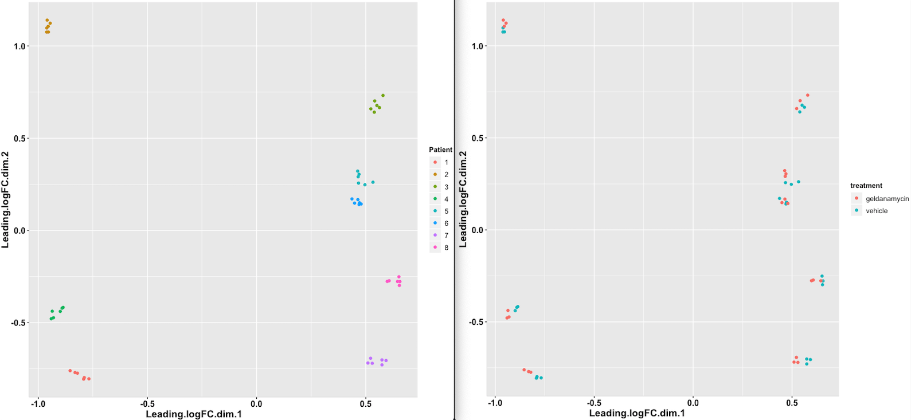

# WORK IN PROGRES: The search for a broad spectrum antiviral: 
## Using differential gene expression analysis & drug repurposing techniques to find compounds with similiar gene expression profiles to the HSP90 inhibitor Geldanamycin

## Abstract

Finding a broad spectrum antiviral compound could greatly help in combating viral diseases, drug resistance and pandemics. One candidate for broad spectrum antivirals are HSP90 inhibitors such as Geldanamycin, however, there may be compounds with similar antiviral properties that are better candidates. Broad spectrum antiviral drug discovery seems to be a particularly neglected area of research perhaps because broad spectrum antivirals may be less useful in developing countries which do not have rapid healthcare/drug access. In this project, bioinformatics methods in gene expression, drug discovery and repurposing were used to find compounds with similar gene expression profiles, and therefore potentially antiviral activity, to the HSP90 inhibitor Geldanamycin. While very preliminary, the results were promising because numerous compounds where found to have similar gene expression profiles, such as FDA approved HDAC inhibitors, which may provide a faster time to market helping to save more lives from viral disease.

## Introduction

Overall it was deemed that this project was unlikely to be an information hazard and so has been made publically available.

### Broad-spectrum antivirals
While broad-spectrum antibiotics are one of the greatest inventions of all times due to their ability to treat a wide array of bacteria, they are ineffective against viruses. Due to viruses being more difficult to disinfect, for this reason, as well as them mutating more rapidly and being more transmissible it's likely the viruses pose a greater risk of pandemic than bacteria. Therefore, a broad spectrum antiviral would be a useful therapeutic and countermeasure to safeguard from this. Especially because a broad spectrum antiviral would be able to administered rapidly regardless of the viral pathogen responsible for the disease/pandemic.

### HSP90 Inhibitors
One such candidate for a broad spectrum antiviral are HSP90 inhibitors (HSP90is), some of which are in clinical trials as an anti-cancer drug. HSP90is are a class of molecules which inhibit heat shock proteins. Heat shock proteins are chaperone proteins which play an important role in the synthesis and folding of proteins in humans. It is these mechanisms which are often hijacked by a wide variety of viruses and used to make viral proteins. Therefore, by inhibiting these proteins with HSP90is it is possible to prevent viruses from replicating. While they may not be suitable as a long-term treatment due to their side effects/toxicity they may proivde an effective countermeasure in a pandemic by buying more time for vaccine development.

### Drug repurposing
One of the biggest challenges of developing HSP90is as a broad spectrum antiviral is their toxicity (Wang et al., 2017). Therefore, by using drug repurposing methods it may be possible to find other compounds which posses the same antiviral activity as HSP90is, however, are already approved drugs and are therefore likely to be much safer. In general, repurposed drugs are approved sooner (3-12 years), at a redeuced cost (50-60%) and are more likely to be approved (Hernandez et al., 2017).

## Aims
The aim of this project was to find compounds with similiar gene expression profiles to the HSP90 inhibitor Geldanamycin, especially compounds which are already approved. This is becasue such compounds may have similiar antiviral activity as HSP90is while having lower toxicity and greater chance of approval.

## Methods

Scripts were written in [Nextflow](https://www.nextflow.io/) which is a workflow manager allowing highly scalable and parralelised analysis. [Docker](https://www.docker.com/) containers were used to bundle software dependencies for reproducibility. The first three steps were run on [Lifebit's Deploit](https://lifebit.ai/deploit) platform which allows versioning and sharing of the analysis.

### 1) Download the data
A [data-donwloader](https://github.com/PhilPalmer/data-downloader) pipeline was written & executed to download publicly available bulk RNASeq data from EMBL-EBI.
In total [96 FastQ files](data/1_download/urls.txt) (94 GB) of raw gzipped paired-end data from the study [PRJNA480665]( https://www.ncbi.nlm.nih.gov/bioproject/PRJNA480665) were used.
The data came from eight patients and contained airway epithelia cells treated with and without the HSP90 inhibitor Geldanamycin.

For full execution details see [Deploit job](https://deploit.lifebit.ai/public/jobs/5d7bfd7e12638d00d8ff7c9b)

### 2) Run RNASeq analysis to generate feature counts
The download reads were then analysed using the [nf-core/rnaseq](https://github.com/nf-core/rnaseq) pipeline, which is developed by the open source bioinformatics community. The reads were first trimmed using [TrimGalore](https://github.com/nf-core/rnaseq/blob/master/docs/output.md#trimgalore) to remove adapter sequences/contamination from the sequencing and to remove low quality regions. The reads could then be aligned to the GRCh37 reference genome using [STAR](https://github.com/nf-core/rnaseq/blob/master/docs/output.md#star). After the alignment it was then possible to determine the gene counts using [FeatureCounts](https://github.com/nf-core/rnaseq/blob/master/docs/output.md#featurecounts) and merge this data for all of the samples.

For full execution details & [Multiqc report](reports/multiqc_report.html) see [Deploit job](https://deploit.lifebit.ai/public/jobs/5d7e2f041b814e00d7d17ffe)

### 3) Run differential gene expression analysis
The [merged gene counts](data/2_rnaseq/merged_gene_counts.txt) were then used to generate a list of [differenitally expressed genes](data/3_differential_gene_expression/diffexpr-results.csv) with [lifebit-ai/dean](https://github.com/lifebit-ai/dean) pipeline and DESeq2. This [experiment file](data/3_differential_gene_expression/experiment.csv) was also used as input data to assign each of reads the relevant experimental group.

For full execution details & [R Markdown report](reports/DE_with_DEseq2.html) see [Deploit job](https://deploit.lifebit.ai/public/jobs/5d7e510d1b814e00d7d1a155)

### 4) Drug repurposing: find compounds with similiar gene expression profiles
From the list of [differenitally expressed genes](data/3_differential_gene_expression/diffexpr-results.csv) a [R Script](data/4_drug_repurposing/get_top_genes.R) was used to extract the top [under](data/4_drug_repurposing/under_expressed.txt) and [over](data/4_drug_repurposing/over_expressed.txt) expressed genes based on the adjusted p-value. This data was then uploaded to the [Connectivity Map](https://clue.io/) to find [compounds](data/5_data_viz/summary.txt) with similiar gene expression profiles.

### 5) Data visualisation: display the results in an appealing way to aid data exploration

A [R Shiny web app](https://philpalmer.shinyapps.io/antiviral_drug_repurposing/) was built to visualise the drug repurposing results. This allowed the identification of mechanism of actions, associated conditions, targets and pathways that were common across multiple compounds which have similiar gene expression profiles. Data across [all](data/5_data_viz/summary.txt) cell lines and the cell line [A549](data/5_data_viz/cell_line_A549.txt) were used. Cell line A549 was chosen because the samples were from airway epithelia cells which may have a more similiar gene expression profile to alveolar basal epithelial cells compared to other cell types.

## Results

By plotting the data from the RNASeq [edgeR sample correlation](data/2_rnaseq/edgeR_MDS_Aplot_coordinates_mqc.csv) it seemed as though the differences in gene expression between the patients were greater than those between the experimental groups of Geldanamycin treatment compared with the control. Therefore, the design formua (`∼ patient + treatment`) for the DESeq2 analysis was used to try and control for the effect of patient.

However, as shown by the sample distance matrix from the differential expression analysis we can see that the Geldanamycin treatment wasn't able to sufficiently distinguish from the control samples, as shown by the fact that the organge and green samples were not grouped togther in the matrix.

In total 25 compounds were found to have a similarity score over 95 for cell line A549.

In total six compounds were found with a similairty score over 95, two of these compounds were HDAC inhibitors

| Score | Name                              | Description                       |
| ----- | --------------------------------- | --------------------------------- |
| 99.98 | AG-490                            | EGFR inhibitor                    |
| 99.83 | nor-binaltorphimine               | Opioid receptor antagonist        |
| 99.8  | corynanthine                      | Adrenergic receptor antagonist    |
| 99.56 | tetrahydrobiopterin               | Nitric oxide stimulant            |
| 99.56 | 16,16-dimethylprostaglandin-e2    | Prostanoid receptor agonist       |
| 99.53 | velnacrine                        | cholinesterase inhibitor          |

## Discussion
A relatively high number of compounds were to have similiar gene expression profiles to Geldanamycin. This is especially promising given that the Connectivity Map database largely conists of FDA-approved drugs and so this may mean that it is likely that there may be other compounds with similiar gene expression profiles which may be already approved drugs. Some of these compounds may confer similiar antiviral activity to HSP90is and be able to gain market approval sooner than HSP90is as a broad spectrum antiviral.

For example, the top compound from the drug repurposing, AG490, has been shown to have some antiviral properties agaisnt the herpes simplex virus (Yura et al., 1997) and down-regulate HSP70 expression (another chaperon protein) (Xu et al., 2018). AG490 is a kinase inhibitor which inhibits EGFR, a host factor broadly required by viruses, and so it along with other kinase inhibitors is a broad spectrum antiviral candidate (Schor and Einav, 2018). Whereas other compounds are already approved drugs such as Vidarabine which is an antiviral compound which may have broad spectrum effects. As well as HDAC inhibitors which have a shred mechanism of action as HSP90 inhibitors and there are currently four approved (anti-cancer) drugs for (Pezzulo et al., 2019). This method could be applied to more publicly available datasets and different host-directed antivirals. Further research could be done using pathway analysis to find suitable a mechanism of action, target and pathway such as the methods used in Prussia et al., 2011.

However, some limitations of the project were that the gene expression profile used here may not capture the treatment of Geldanamycin well. This can be shown by the sample distance matrix where, despite adjusting for the patients, the Geldanamycin treated samples did not cluster together. This may mean that there was another confounding variable which was contributing to the gene expression profile. It seems like the gene expression profile does not accurately represent Geldanamycin treatment because Geldanamycin was ranked very low in terms of similarity score when it should have been the highest. The highest HSP inhibitor was dihydro-7-desacetyldeoxygedunin which had a similarity score of 88.56. Therefore, further work needs to be done to produce a more representative gene expression profile of a HSP90i before finding compounds with a similiar gene expression profile to this.

Other limitations are that just because compounds have a similiar expression profile does not necessarily mean that they will confer similiar antiviral activity. This could be imporved upon with better experimental design. A limitation of this project was the available public data which highly restricted the number of possible experimental questions that could be asked. Instead screening could be performed whereby cells infected with viruses could be treated with the different compounds and the number of live dead cells recorded. This would be beneficial in that compounds with very different expression profiles to HSP90is which are still effective antivirals would not be discriminated against. Single cell RNA sequencing of these samples could be used and differential expression analysis performed to get higher resolution detail of the genes/pathways which are affected. *In vivo* toxicity could also be investigated as this seems to be one of the key bottlenecks for the current clinical trials for HSP90is as an anti-cancer drug (Wang et al., 2017).

Another limitation is that the cell line which was used for the gene expression profile was different from that used to comapre against drugs in the Connectivity Map database. While both were from epithelial cells, this is a confounding variable and so a cell line used in the Connectivity Map database should have been used to measure the gene exression profile. Also, it may be possible to replicate and improve upon the results generating by the Connectivity Map by training and testing custom machine learning algorithms such as GANs to find compounds with similiar gene expressiom profiles.

### HDAC
- HDAC inhibitors in particular seem to have similiar gene expression profiles because two of the top four compounds were HDAC inhibitors. This may be the case because HDAC inhibitors effect HSP90 chaperons and cause the release and degradation of the HSP90 client proteins (RASGRP1 and CRAF).
- HDAC inhibitors and HSP90 inhibitors have a shared mechanism of action
- While approved the drug has severe side effects
- HDAC inhibitors may decrease immune response
- HDAC inhibitors could ~be used as a broad spectrum antiviral. Already shown antiviral activity & currently four approved (anti-cancer) drugs
- HDAC inhibitors also inhibit HSP90 proteins? https://www.ncbi.nlm.nih.gov/pmc/articles/PMC5474223/
Further research:
- more backgroound reading about HSP90i's
- more investigation of pathways/MoA
- validation eg single cell RNASeq analysis - in vivo?
- more work around finding compounds with similiar gene expression profiles (ML?)

## References
1. Somerville, C. and Youngs, H. (2018). Research and Development to Decrease Biosecurity Risks from Viral Pathogens. [online] Open Philanthropy Project. Available at: https://www.openphilanthropy.org/research/cause-reports/research-and-development-decrease-biosecurity-risks-viral-pathogens [Accessed 22 Sep. 2019].
2. Wang, Y., Jin, F., Wang, R., Li, F., Wu, Y., Kitazato, K. and Wang, Y. (2017). HSP90: a promising broad-spectrum antiviral drug target. Archives of Virology, 162(11), pp.3269-3282.
3. Pezzulo, A., Tudas, R., Stewart, C., Buonfiglio, L., Lindsay, B., Taft, P., Gansemer, N. and Zabner, J. (2019). HSP90 inhibitor geldanamycin reverts IL-13– and IL-17–induced airway goblet cell metaplasia. Journal of Clinical Investigation, 129(2), pp.744-758.
4. Hernandez, J., Pryszlak, M., Smith, L., Yanchus, C., Kurji, N., Shahani, V. and Molinski, S. (2017). Giving Drugs a Second Chance: Overcoming Regulatory and Financial Hurdles in Repurposing Approved Drugs As Cancer Therapeutics. Frontiers in Oncology, 7.
5. Yura, Y., Kusaka, J., Tsujimoto, H., Yoshioka, Y., Yoshida, H. and Sato, M. (1997). Effects of Protein Tyrosine Kinase Inhibitors on the Replication of Herpes Simplex Virus and the Phosphorylation of Viral Proteins. Intervirology, 40(1), pp.7-14.
6. Xu, N., Chen, Y., Liu, W., Chen, Y., Fan, Z., Liu, M. and Li, L. (2018). Inhibition of JAK2/STAT3 Signaling Pathway Suppresses Proliferation of Burkitt’s Lymphoma Raji Cells via Cell Cycle Progression, Apoptosis, and Oxidative Stress by Modulating HSP70. Medical Science Monitor, 24, pp.6255-6263.
7. Schor, S. and Einav, S. (2018). Repurposing of Kinase Inhibitors as Broad-Spectrum Antiviral Drugs. DNA and Cell Biology, 37(2), pp.63-69.
8. Prussia, A., Thepchatri, P., Snyder, J. and Plemper, R. (2011). Systematic Approaches towards the Development of Host-Directed Antiviral Therapeutics. International Journal of Molecular Sciences, 12(6), pp.4027-4052.