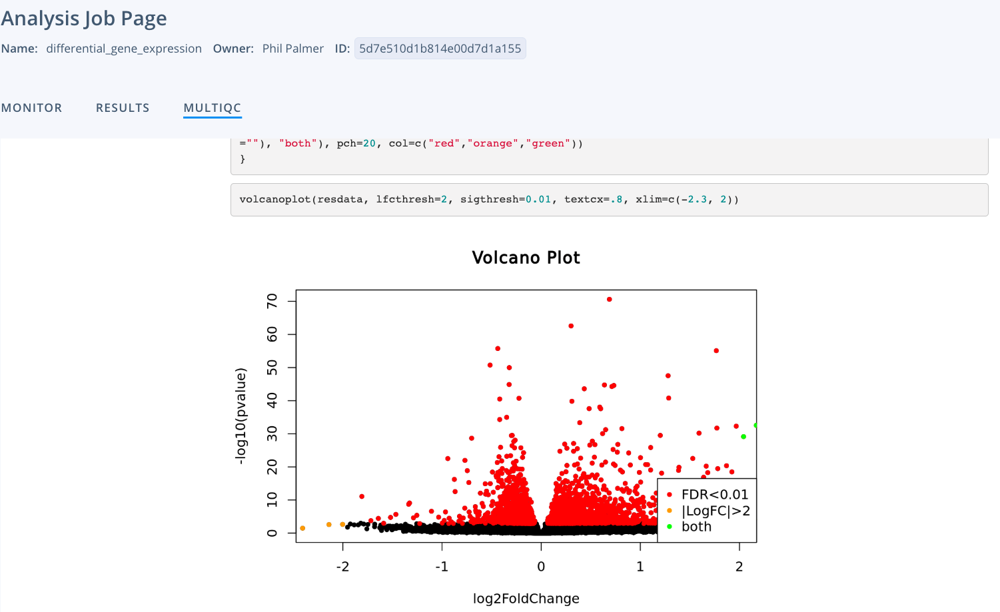

# WORK IN PROGRES: The search for a broad spectrum antiviral: 
## Using differential gene expression analysis & drug repurposing techniques to find compounds with similiar gene expression profiles to the HSP90 inhibitor Geldanamycin

## Abstract

Finding a broad spectrum antiviral compound could greatly help in combating viral diseases, drug resistance and pandemics. One candidate for broad spectrum antivirals are HSP90 inhibitors such as Geldanamycin, however, there may be compounds with similar antiviral properties that may be a better candidate. Antiviral drug discovery seems to be a particularly neglected area of research perhaps because broad spectrum antivirals may be less useful in developing countries which do not have rapid healthcare/drug access. In this project, bioinformatics methods in gene expression, drug discovery and repurposing were used to find compounds with similar gene expression profiles, and therefore potentially antiviral activity, to the HSP90 inhibitor Geldanamycin. While very preliminary, the results were promising because numerous compounds where found to have similar gene expression profiles, such as FDA approved HDAC inhibitors, which may provide a faster time to market helping to save thousands of lives.

## Motivation / the problem
- Broad-spectrum antivirals
  - Antibiotics
  - Viruses are ~more dangerous than bacteria
    - More transmissible
    - More difficult to disinfect
  - Useful as a countermeasure/therapeutic regardless of the pathogen
- HSP90
  - ~Neglected because less useful for developing countries without rapid healthcare/drug access
  - ~Buy time for vaccine development
- Biosecurity
  - Spanish flu
  - Enginered pathogens ~more dangerous
  - Long-term future / existential risk
- Drug repurposing
    - To combat the biggest challenge of developing HSP90 inhibitors as antivirals, their toxicity (Wang et al., 2017)
    - Weak mechanism of action?
- Unlikely to be information hazard

## Background / Introduction

## Aims
The aim was to find known compounds with similiar gene expression profiles to the HSP90 inhibitor Geldanamycin.
- New classification of known compounds as HSP90 inhibitors
- Find approved drugs with the same gene expression profile & therefore activity as HSP90i's

## Methods

Scripts were written in [Nextflow](https://www.nextflow.io/) which is a workflow manager allowing highly scalable and parralelised analysis. [Docker](https://www.docker.com/) containers were used to bundle software dependencies for reproducibility. The first three steps were run on [Lifebit's Deploit](https://lifebit.ai/deploit) platform which allows versioning and sharing of the analysis.

### 1) Download the data
A [data-donwloader](https://github.com/PhilPalmer/data-downloader) pipeline was written & executed to download bulk RNASeq data from EMBL-EBI.
In total [96 FastQ files](data/1_download/urls.txt) (94 GB) of raw gzipped paired-end data from the study [PRJNA480665]( https://www.ncbi.nlm.nih.gov/bioproject/PRJNA480665) were used.
The data came from eight patients and contained airway epithelia cells treated with and without the HSP90 inhibitor Geldanamycin.

For full execution details [see Deploit job link](https://deploit.lifebit.ai/public/jobs/5d7bfd7e12638d00d8ff7c9b)

### 2) Run RNASeq analysis to generate feature counts
The download reads were then analysed using the [nf-core/rnaseq](https://github.com/nf-core/rnaseq) pipeline, which is developed by the open source bioinformatics community. This including adapter trimming using [TrimGalore](https://github.com/nf-core/rnaseq/blob/master/docs/output.md#trimgalore), alignment to the GRCh37 reference genome using [STAR](https://github.com/nf-core/rnaseq/blob/master/docs/output.md#star) and gene counts using [FeatureCounts](https://github.com/nf-core/rnaseq/blob/master/docs/output.md#featurecounts).

For full execution details & [Multiqc report](reports/multiqc_report.html) [see Deploit job link](https://deploit.lifebit.ai/public/jobs/5d7e2f041b814e00d7d17ffe)

### 3) Run differential gene expression analysis
The merged gene counts were then used to generate a [list of differenitally expressed genes](data/3_differential_gene_expression/diffexpr-results.csv) with [lifebit-ai/dean](https://github.com/lifebit-ai/dean) pipeline and DESeq2. This [experiment file](data/3_differential_gene_expression/experiment.csv) was also used as input data to assign each of reads the relevant experimental group.

For full execution details & [R Markdown report](reports/DE_with_DEseq2.html) [see Deploit job link](https://deploit.lifebit.ai/public/jobs/5d7e510d1b814e00d7d1a155)

### 4) Drug repurposing: find compounds with similiar gene expression profiles
From the list of [differenitally expressed genes](data/3_differential_gene_expression/diffexpr-results.csv) a [R Script](data/4_drug_repurposing/get_top_genes.R) was used to extract the top [under](data/4_drug_repurposing/under_expressed.txt) and [over](data/4_drug_repurposing/over_expressed.txt) expressed genes based on adjusted p-value. This data was then uploaded to [clue.io](https://clue.io/) to find [compounds](data/4_drug_repurposing/ranked_compounds.txt) with similiar gene expression profiles.

### 5) Data visualisation: display the results in an appealing way to aid data exploration

TBD

Please note this was done over the course of a few days and so there is lots more that I would like to do.

## Results
- HDAC inhibitors could ~be used as a broad spectrum antiviral. Already shown antiviral activity & currently four approved (anti-cancer) drugs

## Discussion
- As it seemed like the treatment with Geldanamycin wasn't able to distinguish between the samples the gene expression profile may be for a co-variate instead (see sample distance matrix & pca biplot)
- HDAC inhibitors also inhibit HSP90 proteins? https://www.ncbi.nlm.nih.gov/pmc/articles/PMC5474223/
Further research:
- more backgroound reading about HSP90i's
- more investigation of pathways/MoA
- validation eg single cell RNASeq analysis - in vivo?
- more work around finding compounds with similiar gene expression profiles (ML?)

## References
- Only 2% drugs can be repurposed https://insight.jbs.cam.ac.uk/2018/limits-of-drug-repurposing/
- Open phil R&D reduce risk of viral pathogens https://www.openphilanthropy.org/research/cause-reports/research-and-development-decrease-biosecurity-risks-viral-pathogens
- Open phil https://www.ncbi.nlm.nih.gov/pmc/articles/PMC5576214/